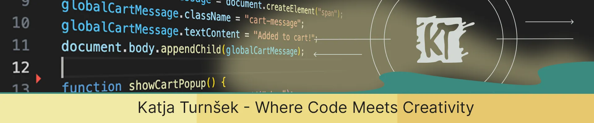

# 👋 Hi there, I'm Katja Turnšek

🎓 Front-End Development student at Noroff  
🎨 Passionate about UI/UX, accessibility, and building responsive web experiences

---

## 👩‍💻 About Me

- 💬 I love building clean, accessible, and user-friendly interfaces  
- 👯 I’m looking to collaborate on creative front-end projects, especially those involving animation or user experience design  
- 🌱 Currently learning React and GSAP for advanced interactions  
- ⚡ Fun fact: I’m a dog agility nerd!

---

## 💻 Tech Stack

Currently learning: React & GSAP animations

---

## 🌟 Featured Projects

### 🧥 [Rainydays](https://norofffeu.github.io/html-css-course-assignment-KatjaTurnsek/)
E-commerce product page with responsive layout, shopping cart, and API integration.  
🔗 [GitHub Repo](https://github.com/NoroffFEU/html-css-course-assignment-KatjaTurnsek)

---

### 🧪 [Semester Project 1](https://katjaturnsek.github.io/Semester-project-1/)
Homepage for a fictional science museum, built with semantic HTML and interactive elements.  
🔗 [GitHub Repo](https://github.com/KatjaTurnsek/Semester-project-1)

---

### 🐶 [Agility Bandits Blog](https://agilitybandits-centre.netlify.app)
Responsive blog site powered by the Noroff API with article pages, carousel, and admin login.  
🔗 [GitHub Repo](https://github.com/NoroffFEU/FED1-PE1-KatjaTurnsek)

---

### 🎨 [Pet Art with Heart](https://www.pet-art.net)
Personal website showcasing hand-painted pet portraits and custom artwork commissions

---

## 🧰 Portfolio Website

📁 [View my Portfolio](https://katjaturnsek.github.io/portfolio-noroff/)  
📝 Includes downloadable reflection PDF and selected projects

---

## 📬 Let's Connect

  

